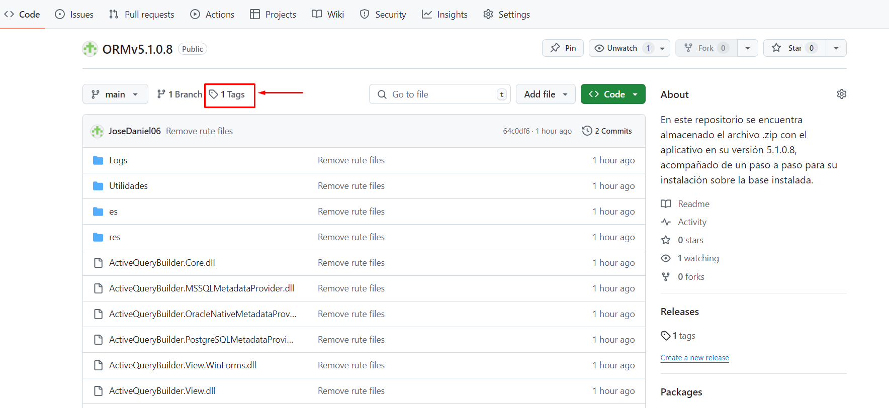
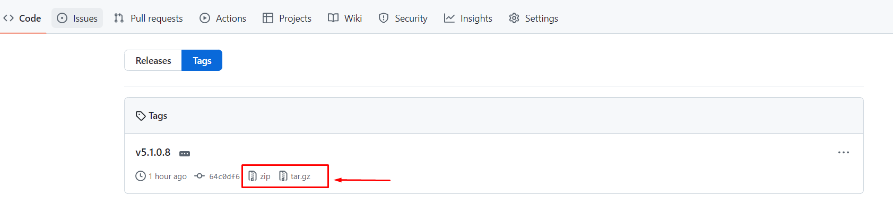

# Novedades versión 5.1.0.8
Se realiza un ajuste en las propiedades del apartado 'Tabla Dinámica' al exportar componente pivot para que no incluya obligatoriamente los campos no utilizados.
# Instalación ORM v5.1.0.8
Como primer paso se debe descargar el archivo ORMv5_8.zip
------------------------------------------------------------
Para descargarlo primero se debe dar clic en el icono Tags

Luego se debe dar clic

Así mismo iniciara la descarga

# Base instalada versiones anteriores ORM
Sí actualmente cuenta con algunas de las versiones de ORM, el proceso es el siguiente:
    Debe copiar los siguientes archivos:
* ORM.ini
* ORMDatabases.txt
* tnsnames.ora  
    De la carpeta actual donde se encuentra instalado su ORM.
    

    Posterior debera pegarlos en la carpeta de la nueva versión ORMv5_8 y dar clic en **REEMPLAZAR**
    
    

    
# Desplegar el aplicativo

   Una vez se encuentre los archivos en la carpeta nueva, se debe dar clic en el ORM.exe

   

   Se desplegara la pantalla de inicio

    

   Para validar la versión de ORM desde esta pantalla se debe dar doble clic en el icono:

   
